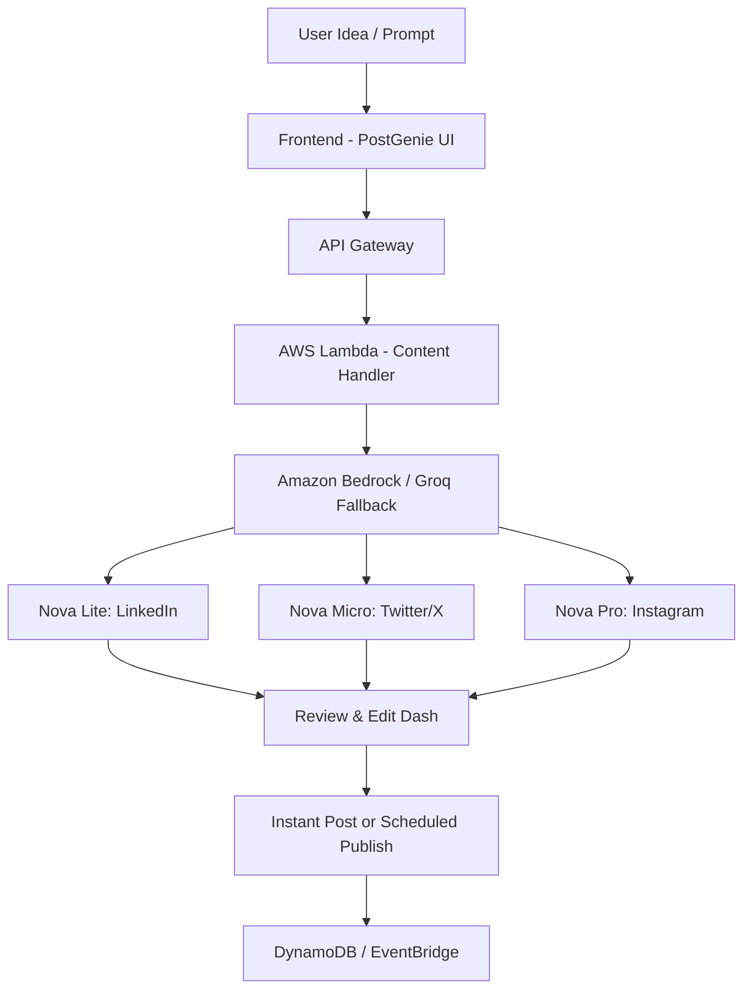

# PostGenie AI

PostGenie AI is an AI-powered platform that transforms a single idea into platform-optimized social media posts. By leveraging Amazon Bedrock’s advanced foundation models, the system generates tailored content for platforms such as LinkedIn, X, Instagram, and Facebook while maintaining a consistent brand voice. 


The platform also enables users to edit, regenerate, schedule, and publish posts directly to their connected social accounts. With its modern and intuitive interface, PostGenie AI simplifies and accelerates the entire social media content creation workflow.

## 🚀 Hackathon Information

This project was built for the **AI For Bharat 2026**.
The goal of the challenge was to design an AI-driven solution that improves digital content creation and workflows, leveraging the power of Amazon Bedrock and serverless architecture.

- **Hackathon Name:** AI For Bharat 2026
- **Track:** Student Track
- **Problem Statement:** Design an AI-driven solution that helps create, manage, personalize, or distribute digital content more effectively.
- **Team Name:** NeuralCoderz
- **Team Members:** 1. Bikram Mondal (Solo Participant)

## 📉 Problem Statement

Many creators and businesses struggle to produce optimized content across multiple social media platforms. Each platform demands a distinct tone, format, length, and engagement style—such as platform-specific hooks, hashtags, and writing structure. As a result, adapting the same idea for different platforms becomes time-consuming, and manual cross-posting often leads to inconsistent quality and reduced engagement on some platforms.

## ✨ Our Solution

**PostGenie AI** transforms a single idea into multiple platform-ready posts using an AI-driven, multi-model generation strategy. By leveraging the latest foundation models available through Amazon Bedrock, the system tailors content specifically for platforms such as **LinkedIn**, **Twitter (X)**, and **Instagram**, while maintaining a consistent brand voice and messaging across all channels.

With a single click, users can generate platform-optimized posts for multiple social media networks simultaneously. PostGenie AI also enables users to instantly publish the generated content to their connected social accounts (LinkedIn & Twitter supported) or schedule posts for a later time, streamlining the entire content distribution workflow.

## 🛠 Key Features

- **AI-Powered Post Generation:** Instant generation of posts for LinkedIn, Twitter, and Instagram from a single prompt.
- **Platform-Specific Optimization:** Automatic adjustment of tone, length, and formatting for each social network.
- **Tone & Voice Customization:** Create and save custom "System Instructions" (Voice Profiles) to guide the AI in matching your specific brand personality.
- **Modern & User-Friendly UI:** A clean, intuitive, and responsive interface designed for efficient content creation, editing, and management.
- **Multi-platform Post Cards:** Visual cards representing how your post will look on each platform before you publish.
- **Image Support:** Upload images to accompany your posts. *AI-based image generation is currently under development as a future enhancement.*
- **Scheduled Publishing:** Plan your content calendar and schedule posts for future publication using Amazon EventBridge.
- **Post Editing & Export:** Copy generated content, regenerate specific platforms, edit text manually, and export posts for future use.
- **Account & Profile Management:** Personalize your profile with an avatar, set timezones for accurate scheduling, and update security settings.

## ⚙️ How It Works



1. **User Idea:** Input a core concept into the platform.
2. **AI Processing:** The system uses **Amazon Bedrock** (with **Groq** fallback) to process the idea.
3. **Multi-Model Strategy:** Different models generate content for different platforms (Nova Lite for LinkedIn, Micro for Twitter, Pro for Instagram).
4. **Customization:** User-defined system instructions are applied to maintain brand consistency.
5. **Publishing:** Content is either sent immediately to social APIs or queued for scheduling.

## ☁️ AWS Services Used

| AWS Service | Purpose |
|-------------|---------|
| **Amazon Bedrock** | Core AI engine for post generation (using Nova foundation models) |
| **AWS Lambda** | Serverless backend execution for API logic and publishing tasks |
| **Amazon API Gateway** | Secure entry point for the frontend application |
| **Amazon DynamoDB** | Storage for users, connection tokens, posts, and voice profiles |
| **Amazon S3** | Hosting for the frontend static assets and media storage |
| **Amazon CloudFront** | Global Content Delivery Network (CDN) for fast application access |
| **AWS Secrets Manager** | Secure storage for social media OAuth credentials |
| **Amazon EventBridge** | Automated cron jobs for the content scheduling system |

## 🏗 System Architecture

The application is built on a 100% serverless stack for maximum scalability and zero maintenance:

- **Frontend:** Built with **React 18**, **Vite**, **TypeScript**, **Tailwind CSS**, and **Framer Motion**.
- **Backend:** Node.js Lambda functions managed and deployed with **AWS CDK**.
- **Auth:** Custom JWT-based authentication system stored in DynamoDB for secure user sessions.
- **AI Layer:** Leverages **Amazon Bedrock**'s latest Nova models to ensure high-quality and platform-relevant content.

## 🤖 AI Design Strategy

PostGenie AI uses a specialized **"Model-per-Platform"** strategy to optimize for both quality and latency:
- **LinkedIn:** **Nova Lite** (optimized for longer, professional, and conversational storytelling).
- **Twitter (X):** **Nova Micro** (optimized for speed and concise, punchy character-limited text).
- **Instagram:** **Nova Pro** (optimized for highly creative, lifestyle-focused captions and emojis).

Each platform is fed unique system instructions that define the formatting, hashtag density, and engagement techniques unique to that network.

## 🚀 Installation & Setup

### Prerequisites
- Node.js (v18+)
- AWS Account with Bedrock model access granted
- AWS CLI configured correctly

### Backend & Infrastructure Setup
1. Clone the repository and navigate to the root.
2. Install Infrastructure dependencies:
   ```bash
   cd infrastructure
   npm install
   ```
3. Deploy the AWS resources:
   ```bash
   npx cdk deploy
   ```
   *Note: Ensure your environment variables like `JWT_SECRET` are set in your local shell or passed during deployment.*

### Frontend Setup
1. Navigate to the frontend directory:
   ```bash
   cd frontend
   npm install
   ```
2. Create a `.env` file with your `VITE_API_URL` (obtained from the CDK output).
3. Start the application:
   ```bash
   npm run dev
   ```

## 🔐 Environment Variables

### Backend (`.env`)
- `AWS_REGION`: AWS region for Bedrock and DynamoDB.
- `GROQ_API_KEY`: Fallback AI provider key.
- `JWT_SECRET`: Secret for securing user authentication.
- `ENCRYPTION_KEY`: Used to encrypt social media access tokens in the database.

### Frontend (`.env`)
- `VITE_API_URL`: The URL of your deployed AWS API Gateway.

## 👥 Team

- **Bikram Mondal** – Full Stack Web Developer & AI Engineer

## 📄 License

This project is licensed under the **MIT License**.